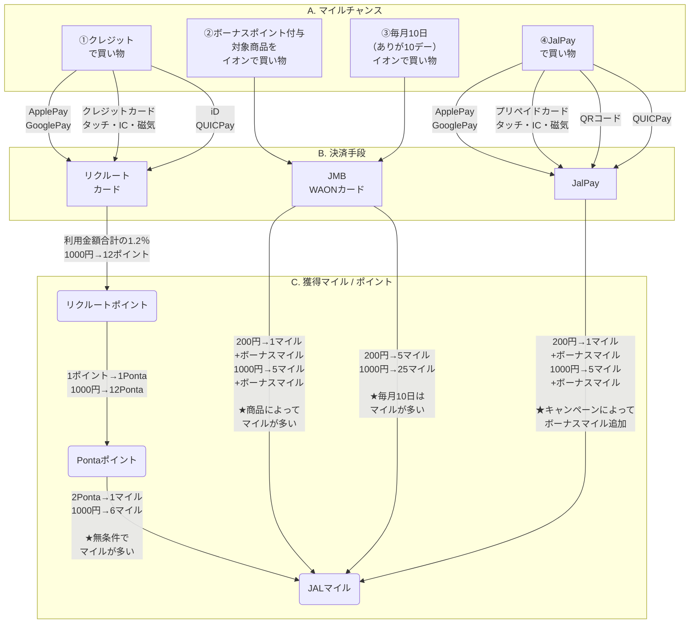

# ポイ活、アップデートしてみました
- 昨年度、下記の記事を書いた内容の2024年度のアップデート版です
  - [ゆるかわののポイ活【2023年6月現在】 - ゆるかわの日記](https://tetsuwan30.hatenablog.com/entry/2023/06/21/105603)
- より細かく、マイル獲得の「たまりやすさ」を数値化し、やりやすい順に
  - **①クレジットで買い物**
    - 1000円 → 6マイル
  - **②ボーナスポイント付与対象製品をイオンで買い物**
    - 1000円 → 5マイル + ボーナスマイル
  - **③毎月10日（ありが10デー）にイオンで買い物**
    - 1000円 → 25マイル
  - **④JAL Payで買い物**
    - 1000円 → 5マイル + ボーナスマイルpo
- 決済手段も細かく明記
  - スマホを使った決済（ApplePay, GooglePay, QRコード)
  - カードを使った決済（JMB WAONカード, クレジット・プリペイドカード）
- おまけに楽天ふるさと納税の利用について
  - マイルとは関係ないのですが、旅行に非常に役立つので

# JALマイレージの獲得ルート（2024年度版）

### 関連リンク

- リクルートカードを作る
  - [ポイントを貯める・使う - リクルートカード(Recruit Card)](https://recruit-card.jp/point/)
- JMB WAONカードを作る
  - [JMB WAONとは | 電子マネー WAON [ワオン] 公式サイト](https://www.waon.net/card/jmb/)
- イオンのボーナスポイント、ありが10デー
  - [ボーナスポイント・ボーナスマイルでためる | 電子マネー WAON [ワオン] 公式サイト](https://www.waon.net/point/bonus-point/)
  - [ありが10デー｜お得情報　優待・特典｜イオンリテール株式会社](https://www.aeonretail.jp/campaign/ariga10/)
- JAL Payを作る
  - [JAL Payとは](https://www.jal.co.jp/jp/ja/jmb/jalpay/)
- JAL Payを含む、各種マイルが貯まるキャンペーン情報
  - [JAL | キャンペーン](https://www.jal.co.jp/jp/ja/campaign/jmb/)

# 楽天ふるさと納税
- [ふるさと納税で旅行にいこう！【楽天トラベル】](https://travel.rakuten.co.jp/special/furusato/)
  - ふるさと納税を使って、宿泊やアクティビティをお得に利用することができます
- 楽天以外の他の事業者でも、もちろんOK
  - 他はまだ使ったことがないので、とりあえずこれだけ

### 利用の流れ
- 【1】目的地を決める
  - どこかにマイルを使うときは、余裕を持って
  - [JAL | どこかにマイル](https://www.jal.co.jp/jp/ja/jmb/dokokani/)
-  【2】楽天ふるさと納税で確認
  -   目的地の自治体でふるさと納税クーポンがもらえるか、確認します
-  【3】楽天トラベルで確認
   - クーポンで、気にいった宿屋やアクティビティが利用できるか、確認します
-  【4】寄付とクーポン受取
   - オンラインで寄付し、オンラインでクーポンを受け取ります
-  【5】宿屋やアクティビティを予約
   - 受け取ったクーポンを登録します
   - 予約をして完了です 
